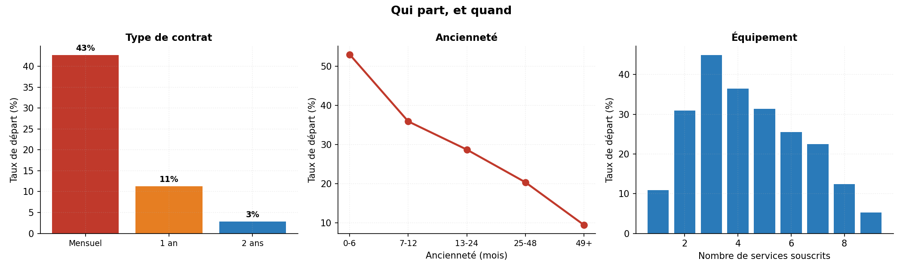
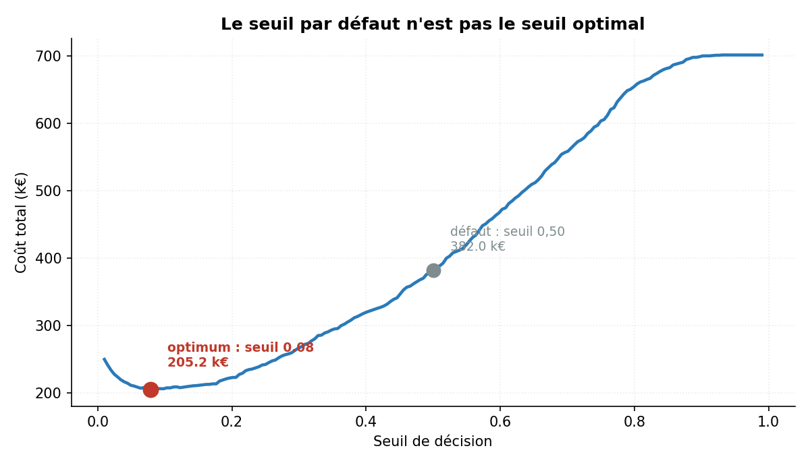
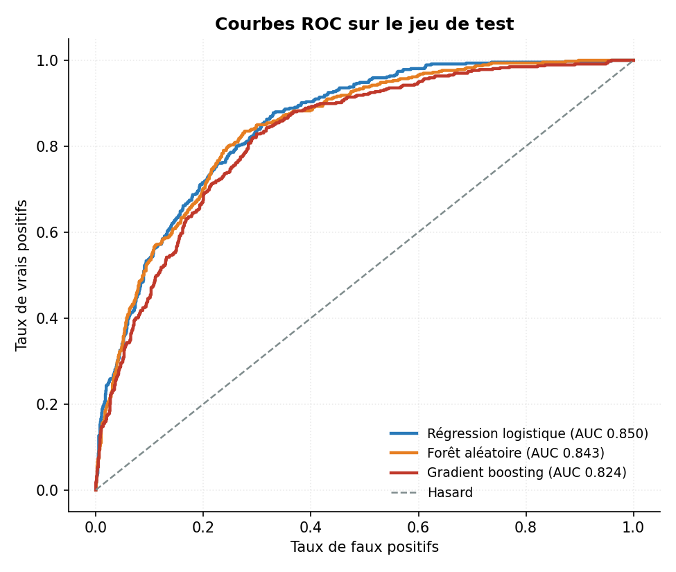
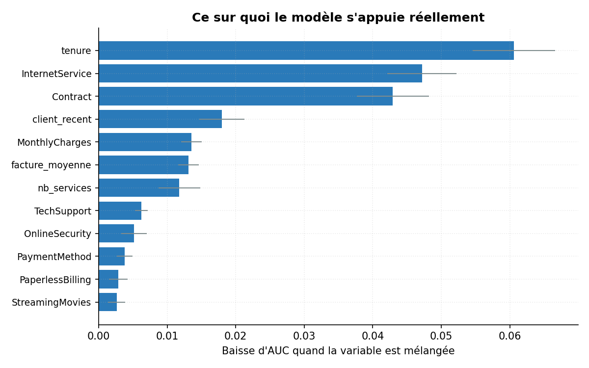

# Prédiction du départ client — et surtout, quoi en faire

Un opérateur télécom perd un quart de ses abonnés. Prédire lesquels vont partir
est un exercice classique. Décider quoi faire de cette prédiction l'est beaucoup
moins, et c'est là que se joue l'essentiel.

Ce projet va jusqu'à la décision : à partir de quelle probabilité faut-il
appeler un client pour le retenir ? La réponse n'est pas 0,50, et l'écart
représente **près de la moitié du coût du dispositif**.



---

## Résultat principal

Le modèle le plus performant atteint une AUC de **0,850** sur le jeu de test.
C'est correct, sans plus — c'est l'ordre de grandeur qu'on obtient sur ces
données.

Ce qui change tout arrive après :

| Stratégie | Clients contactés | Départs évités | Départs manqués | Coût |
|---|---|---|---|---|
| Ne rien faire | 0 | 0 | 467 | 233 500 € |
| Seuil par défaut (0,50) | 370 | 249 | 218 | 127 500 € |
| **Seuil optimisé (0,08)** | 1 162 | **450** | **17** | **66 600 €** |

**Même modèle, mêmes probabilités, aucun réentraînement — seul le seuil de
décision a bougé. 60 900 € économisés, soit 48 %.**

---

## Le raisonnement

Un modèle de classification ne rend pas une décision, il rend une probabilité.
C'est le seuil qui la transforme en action : appeler ce client, ou ne pas
l'appeler. Par défaut, scikit-learn coupe à 0,50 — un choix qui suppose
implicitement que se tromper dans un sens coûte autant que se tromper dans
l'autre.

Ici, ce n'est pas du tout le cas :

- **laisser partir un client sans réagir** coûte la valeur du contrat perdu,
  soit environ **500 €**
- **offrir un geste commercial à un client qui serait resté** coûte le geste
  lui-même, soit environ **50 €** — payé pour chaque client contacté,
  qu'il ait réellement eu l'intention de partir ou non

Une erreur coûte dix fois l'autre. Le bon seuil est donc bien plus bas que
0,50 : mieux vaut appeler plusieurs clients pour rien que d'en laisser filer un
seul.



Le seuil est choisi sur des prédictions hors-échantillon obtenues par validation
croisée sur le jeu d'entraînement, puis appliqué tel quel au jeu de test. Le
choisir directement sur le test reviendrait à optimiser sur les données
d'évaluation, et le gain annoncé serait fictif.

---

## Sensibilité à l'hypothèse de coût

Les 500 € et 50 € sont des hypothèses, pas des mesures. Autant regarder en face
ce qui se passe quand on les change :

| Rapport des coûts | Seuil optimal | Clients contactés | Départs manqués | Gain vs défaut |
|---|---|---|---|---|
| 2:1 | 0,52 | 20 % | 238 | −2 % |
| 5:1 | 0,21 | 46 % | 67 | +22 % |
| **10:1** | **0,08** | **66 %** | **17** | **+48 %** |
| 20:1 | 0,05 | 73 % | 4 | +71 % |
| 50:1 | 0,01 | 93 % | 1 | +85 % |

Ce tableau dit deux choses. D'abord, **le gain annoncé dépend entièrement d'une
hypothèse métier** : à 2:1, le seuil optimal théorique est déjà 0,50 et
optimiser n'apporte rien (−2 %, dans le bruit). Ensuite, **au-delà d'un certain
rapport le modèle devient inutile** — à 50:1 il recommande de contacter 93 % de
la base, ce qu'on aurait pu décider sans lui.

Autrement dit, un modèle de ciblage n'a de valeur que dans une fenêtre de coûts
donnée. Établir cette fenêtre est un travail préalable, pas un détail.

---

## Modèles



| Modèle | AUC validation | AUC test | AP test | Exactitude | Rappel |
|---|---|---|---|---|---|
| **Régression logistique** | 0,846 | **0,850** | 0,657 | 0,808 | 0,533 |
| Forêt aléatoire | 0,843 | 0,843 | 0,646 | 0,803 | 0,497 |
| Gradient boosting | 0,831 | 0,824 | 0,619 | 0,783 | 0,482 |
| Classe majoritaire | 0,500 | 0,500 | 0,265 | **0,735** | 0,000 |

Deux enseignements.

**La régression logistique gagne.** Les modèles à base d'arbres n'apportent rien
ici : la relation entre les variables et le départ est essentiellement
monotone, et le jeu de données est petit. Commencer par le modèle simple n'est
pas une politesse méthodologique, c'est parfois la conclusion.

**La ligne « classe majoritaire » est la plus instructive.** Un modèle qui
répond systématiquement « ce client reste » obtient **73,5 % d'exactitude** sans
détecter le moindre départ. C'est pourquoi l'exactitude est reléguée en fin de
tableau : sur un problème déséquilibré, elle récompense exactement le
comportement qu'on cherche à éviter.

---

## Variables construites



Quatre variables ont été ajoutées, chacune sur une hypothèse de comportement :

| Variable | Hypothèse |
|---|---|
| `nb_services` | plus un client est équipé, plus il est coûteux pour lui de partir |
| `facture_moyenne` | la facture réellement observée, qui peut différer du tarif affiché |
| `evolution_facture` | une hausse récente est un motif de départ fréquent |
| `client_recent` | le risque est concentré sur les premiers mois |

Trois d'entre elles finissent dans les dix variables les plus utiles
(`client_recent`, `facture_moyenne`, `nb_services`), mesurées par **importance
de permutation** — on mélange une colonne au hasard et on regarde de combien
l'AUC chute. Plus fiable que l'importance native des arbres, qui surévalue
mécaniquement les variables à nombreuses modalités.

Le trio de tête reste `tenure`, `InternetService` et `Contract` : l'ancienneté,
le type d'accès et la durée d'engagement. Le profil à risque est un client
récent, en fibre, sans engagement.

---

## Détails de mise en œuvre

**Nettoyage.** `TotalCharges` est lue comme du texte à cause de 11 valeurs
vides. Ces 11 clients ne sont pas des erreurs de saisie : leur ancienneté est
nulle, ils viennent de souscrire et n'ont rien facturé. Les supprimer ferait
perdre l'information « client tout neuf » ; les mettre à 0 est le comportement
correct.

**Pas de fuite de données.** L'encodage et la normalisation sont *à l'intérieur*
du pipeline scikit-learn, pas appliqués en amont sur l'ensemble des données.
Ajuster un `StandardScaler` avant le découpage train/test ferait entrer dans les
moyennes des informations issues du test : le score obtenu serait optimiste et
ne se reproduirait jamais en production. Chaque pli de la validation croisée
réapprend son prétraitement sur ses seules données d'entraînement.

**Découpage stratifié**, 75/25, validation croisée 5 plis stratifiée.

---

## Limites

- **Données publiques et statiques.** Une seule photo à un instant donné : pas
  de dérive dans le temps, alors que les comportements de départ évoluent avec
  les offres et la concurrence.
- **Les coûts sont supposés uniformes.** Un client à 20 €/mois et un client à
  110 €/mois ne représentent pas la même perte. Une version plus fine
  pondérerait le coût par la valeur individuelle du contrat plutôt que par une
  moyenne.
- **L'efficacité du geste commercial est supposée parfaite.** Le calcul admet
  qu'un client contacté est un client retenu. En pratique une campagne de
  rétention convertit une fraction des cibles, et il faudrait intégrer ce taux.
- **Pas de calibration des probabilités.** Le seuil est optimisé sur les scores
  bruts. Une calibration (Platt, isotonique) rendrait les probabilités
  interprétables comme de vraies probabilités, ce qui compte si un humain doit
  les lire.
- **Petit jeu de données** : 7 043 lignes, dont 1 761 en test. Les écarts entre
  modèles proches sont dans le bruit d'échantillonnage.

---

## Reproduire

```bash
git clone https://github.com/kbilen/churn-prediction.git
cd churn-prediction
pip install -r requirements.txt
python run_pipeline.py
```

Environ 20 secondes. Tableaux dans `reports/`, figures dans `figures/`.

## Organisation

```
data/telco_churn.csv   jeu de données (IBM Telco Customer Churn, 7 043 clients)
src/data.py            chargement, nettoyage, variables construites
src/models.py          pipelines de prétraitement et catalogue de modèles
src/decision.py        coûts, balayage de seuils, analyse de sensibilité
src/plots.py           figures
run_pipeline.py        enchaînement complet
```

## Outils

Python, pandas, NumPy, scikit-learn, matplotlib.

## Source des données

IBM Telco Customer Churn — 7 043 clients, 20 variables descriptives,
26,5 % de départs.